# Two games made in Python

This is a web page made to host two games; Hangman and a text adventure game, Escape from the Manor. I made this as I wanted to both make a hangman game that would allow people to choose different themes and potential difficulty within that (i.e. if know more about animals than city names then one is easier than the other). For the text adventure game, I wanted to make a choose your own adventure game with the mini game within that of fighting the monsters within the Manor as you try to escape.

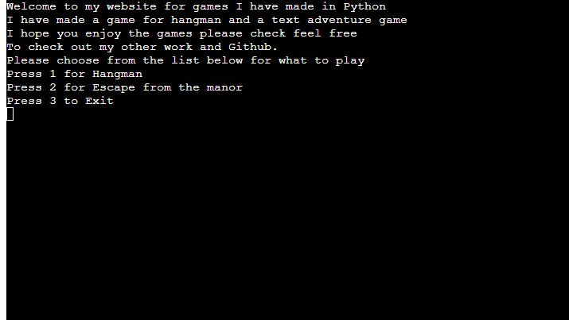

## Features 

-__Main Menu__

This part of the page is for a menu whereby the user can navigate back and forth between the two games. It uses subprocesses to do this and and lets the user exit the program fully as well if they want. 

-__Hangman game__

The game of hangman plays as follows: The user will be asked to choose their theme of words that they will play with, either from animals, cities and countries. Once chosen, the computer will then randomly choose a word from that list. The player then gets to guess either the letters of the word or the word itself and every wrong guess will build the hangman. If the player gets the right word, they'll win but if they guess incorrectly six times, they will lose and the correct word will be shown to them. Regardless of the result, the player will be given the option to play again if they so wish. 

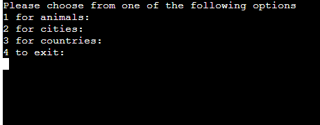

-__Hangman animals list__ 

This is the list that the player can choose at the start of the hangman game that will make it so that all the words will be in the theme of animals.

-__Hangman cities list__ 

This is the list that the player can choose at the start of the hangman game that will make it so that all the words will be in the theme of cities.

-__Hangman countries list__ 

This is the list that the player can choose at the start of the hangman game that will make it so that all the words will be in the theme of countries.

-__Escape from the manor__ 

This is a text adventure game with multiple endings. The user can decide on different paths and will get different endings and even dying from their options. There are opportunities to fight monster and enemies within the game as well which is done by simulating rolling a 20 sided dice. They will hit or miss dependent on that roll and can potentially die if they roll poorly during these fights. 

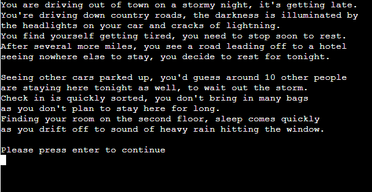

-__Escape from the manor story functions__

There are several functions within the escape from the manor that will allow the user to progress the story based upon their choices. These will either lead to the next scenario, a player death, a fight or an ending to the story. These choices are carried out by what the user inputs.

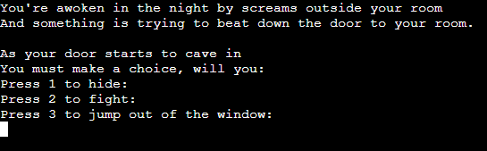

-__Escape from the manor player death__

The player character can die whilst trying to escape and they will get a message to tell them this as well as the option to quit or to try again.

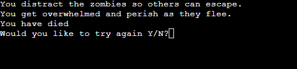

-__Escape from the manor fights__

There are two fights within the game which are carried with a dicing rolling program. The user will choose between two options and that will allow them to take an action according to that option. The "dice" is then rolled and based upon that result the action will either succeed or fail. The two different actions have different difficulties but have greater rewards if they are more difficult. Every successful action will reward the user one hit and one failed action a loss of one health. If the user gets three or more hits they will win the fight but if their health reaches zero they will lose and die.

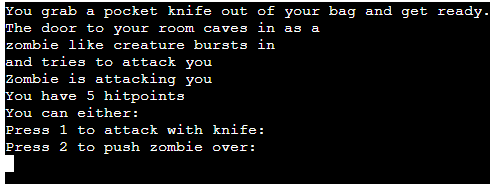

-__Escape from the manor endings__

There are multiple endings for escape from the manor depending on the players choices. A players will get a brief explanation of where these endings lead to.

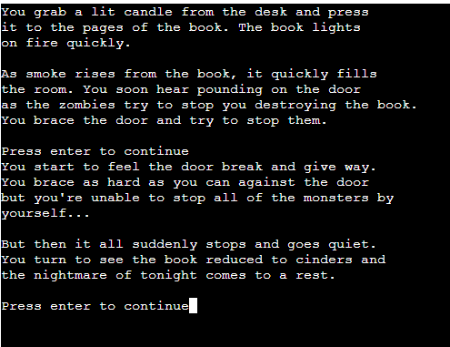

-__Escape from the manor congratulations__

This is to let the player know they survived and gives them the option to play again or go back to the main menu if they so wish.

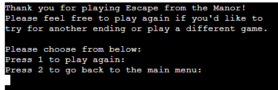

## Testing 

The goal of this project was to create program that would allow the user to play two different games and easily be able to navigate between them. For this I created a main menu, a hangman game and a text adventure game.

For the hangman game, some of the testing came from a few things: implementation of the different lists and how to choose them and also the game looping through properly and catching improper inputs from the user. So to start off with, I wanted to have different lists for hangman to make it a bit easier for the user; the themes and the choice effectively give a hint as to what the user will be needing to guess rather than having them all in one big list. It also gives the game a bit more variety and replayability as well. When initially trying to implement this however, I ran into a problem when the user gave an incorrect input. The function would go back to the start and give them the options again but would fail when they gave a correct input. This seemed to be due to the game generating a null value for the "word" variable which caused the game to crash. So to resolve this, I removed the return word.upper part when choosing the list and instead having that at the start of the game function. I also removed the code for having the player_choice variable be turned into an integer to catch invalid answers if the user typed in a word or letter. 

Another error was caused by the play again section of the code. This was not restarting the game properly at first due to me having the input needing to be equal to an upper case "Y". If the user put in a lower case y the program would just stop all together which wasn't ideal. So to resolve this, I set it so that the input made by the user was returned as an uppercase letter and I also added in a catch for incorrect inputs as well. 

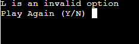

This wasn't an error but a problem with the program was that the console log of the game would get very cluttered as you played due to all the text showing up as you played. It wasn't hard to play but it just looked messy, especially after playing several games and having a wall of text because of it. To combat this, I made a function to clear the log whenever it was called. This way I could easily clear the log when needed in order to keep the text in one place and easier for the user to read. Once made, I implemented this in several points in the code where it felt necessary to clear it, such as starting a new game, restarting it or when you picked a letter. 

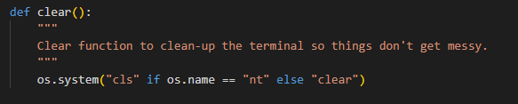

Finally for the hangman section, there was an error that was thrown due to one of my lines of code being over 80 characters long. This was somewhat unavoidable as it was the line for describing each of the lists that the player could choose from so I initially unsure how to fix this. This error wouldn't have caused any issues per se, it was more so just a warning the text would've ended up on a new line rather than it all being on the same line. However it was an error nonetheless and would've been reported when doing my checks at the end. So in order to resolve this issue, I had added in line breaks for where the input calls for each of the lists and as a byproduct this would also improve the look of the section when running the game. 

For the Escape from the Manor. there were some errors that occured but most of the testing came from the best way to implement the timings between the sections for the player to read them and also for the best way to do the combat sections themselves. I will start off with the combat section; I had very loosely based the fights in this game off of how combat is done in Dungeons and Dragons and similar games. For those games, twenty sided dice is rolled, if you roll high enough you hit otherwise miss. In those games you have modifiers to the dice to help you and such but for mine I just have the flat dice roll. So now I needed actions for the player to take and health for the player and the enemy. 

I wanted the player to have two actions; just pressing one over and over again didn't seem the most interactive or interesting so I wanted them to have another option to give the combat a little more thought. That's why I added the option to push or tackle the enemy which is harder than a normal attack but allows the player to do more damage. To win the battle, the player has to "hit" the enemy three times with normal attack doing one hit and the push or tackle doing more damage. Every action they fail though deals one damage to them, which they can see as their hitpoints in combat. 

Once these were put into place, it was just a case of keeping the user in the while loop for combat whilst either the hits are less than 3 and their health is greater than zero. I also played through the scenarios a few times to get a feel of what's fair for the user so their is a decent back and forth in combat without feeling too hard or too easy. 

An error had occured with this though due to how I coded it originally. I originally had the while loop for the cultist fight as "hits >= 3" which was incorrect. This meant so that if the user had dealt exactly three damage to the cultist, the game would continue but they'd never really leave the while loop. So they would continue with the game as normal but when trying to exit the game, they would be taken back to the cultist fight. So to rectify this as mentioned, I corrected it for less than 3 hits to stop this from happening.

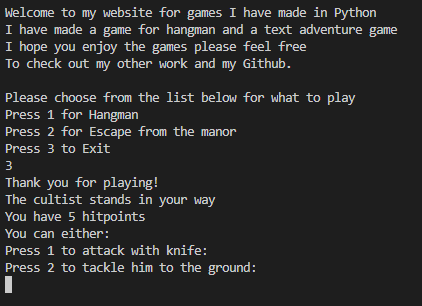

As menitoned previously, I had had some issues with the timings for going from section to section. I wanted to give the user enough to time to read through the text but also didn't want to leave all the text there as it is a just a massive word wall and the console will get very cluttered after combat as well. So to combat this, I had done two things; I first implemented time.sleeps in order to give the game some pacing and also to give the user time to read. This worked for some sections but wasn't ideal for the longer sections so I instead implemented a stop with the user input. They have to press enter to progress certain sections thus allowing them to take as much as they want to read through the text and progress more at their own pace. 

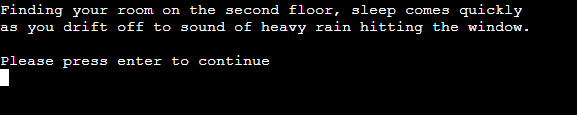

## Data Model

As I have two different games, I have used different data models for each one in order to hold their respective data. 

For the Hangman game, I have the choose_word_list function that will use the random function and the user of external files and lists in order to choose a word for the user based upon their choice of theme. From the theme they choose, a word is randomly chosen and assigned to the variable word and that is then used in the play function to be used as the word to guess for the game. 

As for the Escape from the Manor game, the use of data is shown within the fight and foyer_battle functions; Here I use the variables min_roll and max_roll to simulate rolling a twenty sided dice and hits and health to represent the enemy and player health respectively. The function then runs a while loop that will run until either the hits are 3 or greater or the players health reaches zero. This is determined by the user choosing different actions and the random function being used to determine the outcome of that action. So if they choose to attack and the 'roll' of that attack is high enough, they will hit and do damage or otherwise they will lose health. This will keep going until either the player or the enemy dies i.e. the health reaches 0 or the hits reach at least 3. The game will then progress accordingly to that outcome.

## Bugs

Any bugs that occured in the code I have spoken about in the testing section and they have now all been fixed.

### Remaining Bugs
* No bugs remaining

### Validator Testing
* PEP8
    * No errors were returned from PEP8online.com
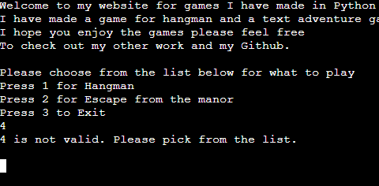

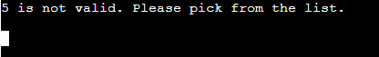

## Deployment
To deploy this project, I had done the following:
1. Used the console to log on to Heroku using the command: 'Heroku login -i'.
2. In the console I had to choose the correct Heroku app using the following command: 'Heroku apps'.
3. I used the following command to select that app so that I could commit to it: Heroku git: 'remote -a two-games-made-for-python'.
4. This is where I put the commit message to both git and heruko:'git add. && git commit -m "input message here"'.
5. To push to both Git and Heroku I used the following commands: 'git push origin main', 'git push Heroku main'.

## Credits

The logic for the play function and the display_tries function were taken from a video by Kite (https://www.youtube.com/watch?v=m4nEnsavl6w)

I had used this article by Python for Beginners as tutorial for dice rollers which were used in the fight and foyer_battles functions (https://www.pythonforbeginners.com/code-snippets-source-code/game-rolling-the-dice)

I had used this page on Stack Overflow as a tutorial for subprocesses and calling external python files (https://stackoverflow.com/questions/9318581/python-how-do-i-call-external-python-programs)
  